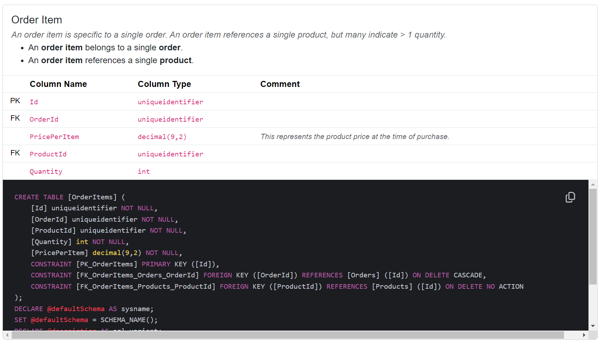

# DbChart
A (very) experimental database documentation generator.

Considering the following EF model:

```cs
[DisplayName("Order Item")]
[Comment("An order item is specific to a single order. An order item references a single product, but many indicate > 1 quantity.")]
public sealed class OrderItem
{
    public Guid Id { get; init; } = Guid.NewGuid();
    public Guid OrderId { get; set; }
    public Guid ProductId { get; set; }
    public int Quantity { get; set; }
    
    [Comment("This represents the product price at the time of purchase.")]
    [Precision(9, 2)]
    public decimal PricePerItem { get; set; }

    [RelationshipDescription("belongs to")]
    public Order Order { get; set; } = null!;

    [RelationshipDescription("references")]
    public Product Product { get; set; } = null!;
}
```


